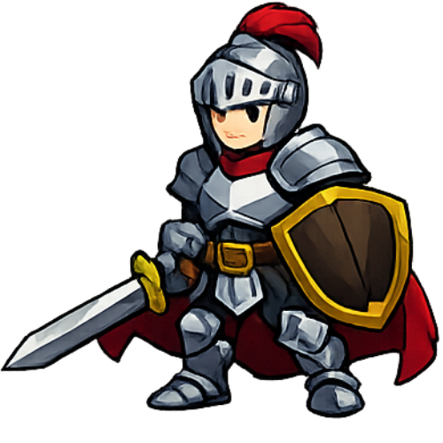
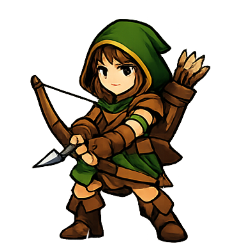

# Personagens

## Classes Jogáveis
| Imagem | Classe | HP | ATK | DEF | SPD | Mana | Skills iniciais |
| --- | --- | --- | --- | --- | --- | --- | --- |
|  | Cavaleiro | 150 | 30 | 15 | 1 | 0 | Grito de Guerra, Giro da Espada (Nv 4) |
|  | Mago | 90 | 25 | 5 | 1 | 100 | Bola de Fogo, Congelar, Incinerar (Nv 4) |
|  | Arqueiro | 110 | 25 | 8 | 2 | 0 | Tiro Certo, Chuva de Flechas (Nv 4) |

## Habilidades
**Bola de Fogo**
- Cooldown: 3s
- Mana: 30
- Efeito: projétil mágico que causa dano total de `ATK * 2` (70% instantâneo + 30% em queimadura por 3 ticks).

**Congelar**
- Cooldown: 4s
- Mana: 25
- Efeito: aplica `Congelar` por 2 ticks e causa dano mágico igual ao ATK.

**Incinerar** (Nv 4)
- Cooldown: 6s
- Mana: 35
- Efeito: aplica queimadura por 3 ticks com dano total `ATK * 1.8`.
- Extra: se o alvo morrer em até 3s, a queimadura se espalha para inimigos vivos com dano total `ATK * 1.2`.

**Grito de Guerra**
- Cooldown: 6s
- Mana: 0
- Efeito: dobra a velocidade de ataque por 3 ticks e cura 10% do HP máximo a cada tick.
- Restrição: só pode usar se estiver abaixo do HP máximo.

**Giro da Espada** (Nv 4)
- Cooldown: 6s
- Mana: 0
- Efeito: ataque em área que causa dano físico `ATK * 1.15` em todos os inimigos vivos.

**Tiro Certo**
- Cooldown: 4s
- Mana: 0
- Efeito: após 1s, dispara flecha crítica causando `ATK * 1.5`.

**Chuva de Flechas** (Nv 4)
- Cooldown: 6s
- Mana: 0
- Efeito: 3 ondas em 3s; cada onda causa `ATK * 0.6` em todos os inimigos vivos.

**Tiro Rápido**
- Cooldown: 2s
- Mana: 0
- Efeito: dispara duas flechas rápidas (visual).

**Escudo**
- Cooldown: 4s
- Mana: 0
- Efeito: aumenta DEF em +10.

**Provocar**
- Cooldown: 5s
- Mana: 0
- Efeito: efeito visual de provocação.

**Foco**
- Cooldown: 5s
- Mana: 0
- Efeito: aumenta ATK em +5.

## Evolução
- Ao subir de nível: HP +15, ATK +4, DEF +2.
- A cada 3 níveis: SPD +1.
