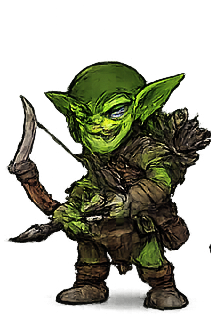
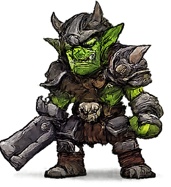
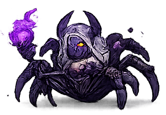
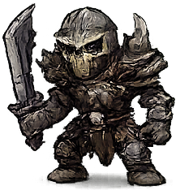
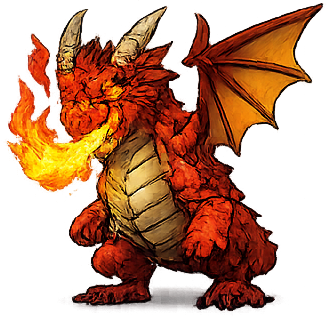
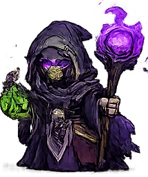

# Monstros

## Catálogo
| Imagem | Monstro | Nível | HP | ATK | DEF | SPD | Observações |
| --- | --- | --- | --- | --- | --- | --- | --- |
|  | Goblin | 1 | 120 | 18 | 6 | 1 | Ataque físico padrão. |
|  | Goblin Arqueiro | 2 | 95 | 20 | 5 | 2 | A cada 3 ataques, dispara duas flechas com 0.8x ATK cada. |
|  | Orc Sanguinario | 3 | 170 | 30 | 10 | 1 | Entra em fúria ao chegar a 50% de HP. |
|  | Aranha do Vazio | 3 | 115 | 24 | 6 | 3 | Chance de aplicar veneno. |
|  | Guerreiro Esqueleto | 4 | 145 | 28 | 12 | 1 | Ataque físico padrão. |
|  | Bruxa | 5 | 140 | 30 | 9 | 2 | Pode amaldiçoar o alvo. |
|  | Bruxa Ancia | 6 | 190 | 42 | 14 | 2 | Bruxa experiente com maldição. |
|  | Dragao | 6 | 320 | 45 | 18 | 1 | Sopro de fogo, fase 2 ao chegar a 50% de HP. |
|  | Mago Esqueleto Sombrio | 8 | 260 | 60 | 18 | 2 | Controle de gelo e alto dano. |

## Habilidades e Comportamentos Especiais
**Bruxa / Bruxa Ancia**
- 35% de chance de aplicar `Maldição` por 3 ticks.
- Efeito: reduz ATK do alvo em 2 enquanto durar.

**Aranha do Vazio**
- 40% de chance de aplicar veneno.
- Efeito: dano total `ATK * 0.9` distribuído em 3 ticks.

**Mago Esqueleto Sombrio**
- A cada 4 ataques, aplica `Congelar` e causa dano de gelo `ATK * 0.6`.

**Orc Sanguinario**
- Fúria ao chegar a 50% de HP.
- Efeito: ATK +5 e velocidade de ataque +30%.

**Dragao**
- Ataque à distância com fogo.
- Fase 2 ao chegar a 50% de HP.
- Efeito: ATK +8 e velocidade de ataque +40%.
